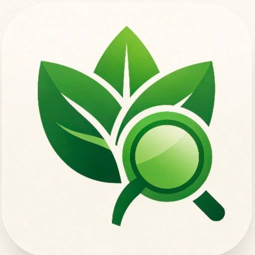
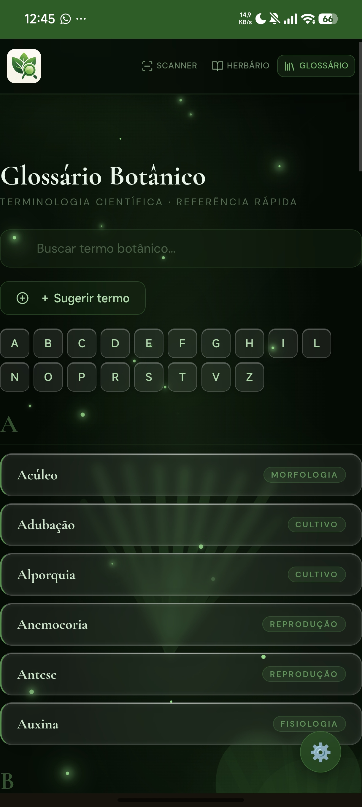
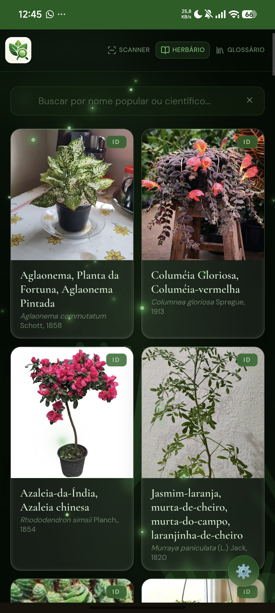
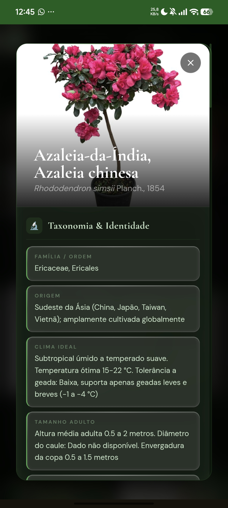
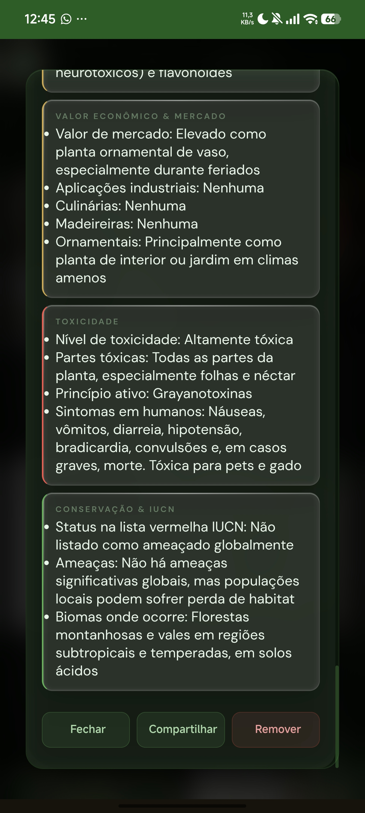

[README (1).md](https://github.com/user-attachments/files/29258104/README.1.md)
<div align="center">



# PlantID

**Engenharia Botânica · Identificação por IA**

[](https://plantid.com.br)
[](https://firebase.google.com)
[](https://deepmind.google/gemini)
[](LICENSE)

[**Acessar o app →**](https://plantid.com.br)

</div>

---

## O que é o PlantID

O PlantID é uma aplicação web de identificação botânica por inteligência artificial. Tire uma foto de qualquer planta e obtenha em segundos uma ficha técnica completa — morfologia, origem, clima ideal, pragas, uso medicinal, toxicidade e muito mais.

Desenvolvido como Trabalho de Conclusão de Curso (TCC) em Licenciatura em Ciências Naturais/Biologia na **Universidade Federal do Maranhão (UFMA)** — Campus Pinheiro, Baixada Maranhense.

---

## Funcionalidades

<table>
<tr>
<td width="50%">

### Scanner Botânico
Identificação em duas etapas com cache inteligente. A primeira chamada identifica o binômio científico; a segunda gera a ficha completa. Espécies já identificadas pela comunidade são carregadas do Firestore instantaneamente, sem custo de API.

</td>
<td width="50%">

### Herbário Digital
Coleção pessoal de plantas identificadas, armazenada localmente e sincronizada na nuvem via Google Sign-In. Suporte a busca por nome popular ou científico.

</td>
</tr>
<tr>
<td width="50%">

### Glossário Botânico
Mais de 60 termos científicos com definições, categorias e sistema de sugestão comunitária. Os termos aparecem em destaque nas fichas das plantas para consulta rápida.

</td>
<td width="50%">

### PlantLab
Enciclopédia botânica colaborativa. Consulte fichas técnicas completas digitando o nome da planta, sem necessidade de foto. Alimentado pelo banco de espécies da comunidade.

</td>
</tr>
</table>

---

## Screenshots

<div align="center">
<table>
<tr>
<td align="center">

<br/><sub>Glossário Botânico</sub>
</td>
<td align="center">

<br/><sub>Herbário Digital</sub>
</td>
<td align="center">

<br/><sub>Ficha Técnica</sub>
</td>
<td align="center">

<br/><sub>Dados Completos</sub>
</td>
</tr>
</table>
</div>

---

## Stack Técnica

| Camada | Tecnologia |
|--------|-----------|
| Frontend | HTML · CSS · JavaScript (vanilla, single-file) |
| IA | Google Gemini 2.5 Flash |
| Backend | Vercel Serverless Functions |
| Banco de dados | Firebase Firestore |
| Autenticação | Firebase Auth (Google Sign-In) |
| Deploy | Vercel · domínio `plantid.com.br` |
| Imagens | WebP com fallback JPEG |

---

## Arquitetura de Cache

O PlantID usa um sistema de cache em três camadas para minimizar chamadas à API do Gemini:

```
Usuário escaneia planta
        │
        ▼
  IndexedDB local  ──── HIT ────► Abre ficha (0ms, gratuito)
        │ MISS
        ▼
  Firestore /especies  ─ HIT ────► Carrega ficha da comunidade
        │ MISS
        ▼
  Gemini API (gera ficha)
        │
        ├──► Salva no IndexedDB local
        └──► Salva no Firestore (disponível para todos os usuários)
```

Com esse modelo, 10.000 usuários que identificarem a mesma espécie utilizam apenas **1 chamada ao Gemini**.

---

## Estrutura do Repositório

```
PLANTID/
├── index.html        # App principal (scanner, herbário, glossário)
├── lab.html          # PlantLab — enciclopédia botânica
├── admin.html        # Painel administrativo
├── api/
│   └── gemini.js     # Serverless function (proxy Gemini)
├── vercel.json       # Configuração de rotas
├── manifest.json     # PWA manifest
└── icon.png          # Ícone do app
```

---

## Contexto Acadêmico

O PlantID nasceu como projeto de TCC com foco na aplicação de tecnologias de inteligência artificial no ensino de Ciências Naturais. O app busca combater a **cegueira botânica** — a dificuldade de perceber e nomear plantas no cotidiano — oferecendo uma ferramenta acessível para estudantes, professores e comunidades tradicionais do Maranhão e de todo o Brasil.

---

## Desenvolvimento

Desenvolvido por **Vinicius Mendes** ([@Jayaxp7](https://github.com/Jayaxp7))  
Licenciatura em Ciências Naturais/Biologia — UFMA, Campus Pinheiro  
Baixada Maranhense, Maranhão, Brasil

---

<div align="center">

[plantid.com.br](https://plantid.com.br) · [PlantLab](https://plantid.com.br/lab) · [Admin](https://plantid.com.br/admin.html)

</div>
